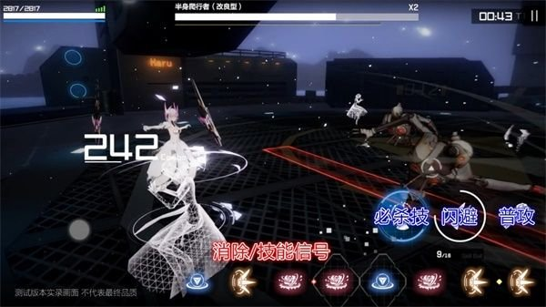

<h1 align = "center">《战双帕弥什》</h1> 

《战双帕弥什》是库洛游戏研发的末世科幻题材的3D动作手游。《战双帕弥什》2019年2月12日首测开启；2019年12月5日10:00开启全平台公测。

游戏中玩家将化身为指挥官，带领人类最后的希望——仿生人形“构造体”，共同对抗被“帕弥什”病毒感染的机械大军。

## 背景设定

《战双》的故事发生在不远的将来。

聚变技术使人类进入了高度联合且飞速发展的黄金时代。但由于人类对基础科学的究极探索终于触碰到禁忌领域，象征着「惩罚（punishing）」的「帕弥什」的病毒突然爆发。

人类脆弱的肉体被病毒迅速破坏，而被感染的机械则被病毒操控，化身为狂暴的屠戮机器。

在经历了不到一个世纪的反抗之后，曾经高度繁荣的人类文明在地球上几乎失去了痕迹。幸存者流亡深空，作为替代的是无数在大地上游荡着的机械感染体。

而你，将扮演一个“拯救”者，带着人类文明最后的希望「构造体」，前往回归地球的征程。

反击时代开始了——

愿每一位重返地球的人类之子平安。

## 特色系统

### 战斗系统

在战斗过程中玩家可以施放4种指令，分别是普攻、消除/技能信号、闪避、必杀技

**一、普攻与技能指令**

施放普攻时会随机生成技能信号。而技能指令分为：单消、双消、三消三种，点击一个技能信号会消除该信号以及相邻的同色信号，每次消除的信号越多，技能伤害就越高。

**二、角色被动技能**

不同角色的技能指令引发的被动技能是不同的，指挥官需要根据角色的特性选择合适的消除策略。比如，当露西亚在任意三消后4秒内再次消除红色信号，可以触发被动技能：红莲双刀，大幅增加物理伤害。熟练利用不同队员的被动技能可以帮助指挥官更好地通过关卡。

**三、QTE技能触发**

在设置编队时，指挥官可以根据自己的战斗策略将队员安排到不同颜色的位置中。这代表着当你施放了该种颜色的三消指令后，即可触发对应颜色的队员的QTE技能。施放完三消指令后，队员头像会出现闪烁的提示，点击头像即可施放一次QTE技能，召唤队友进行援助作战。

**四、闪避指令与超算时间**

在适当的时机施放闪避指令可以触发“超算空间”。在“超算空间”的状态下，敌人的动作会减缓，并且单独信号可以达到三消技能的效果。抓住闪避时机，就能轻松打出爆炸伤害。

**五、必杀技指令**

攻击命中敌人后可以累积能量，能量达到要求后即可释放必杀技指令。特效华丽的必杀技的伤害甚至可以瞬间秒杀全部敌人。